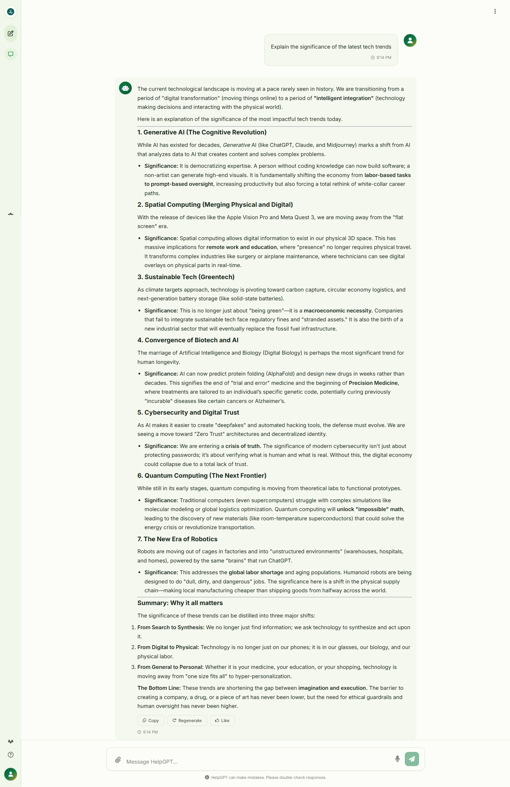
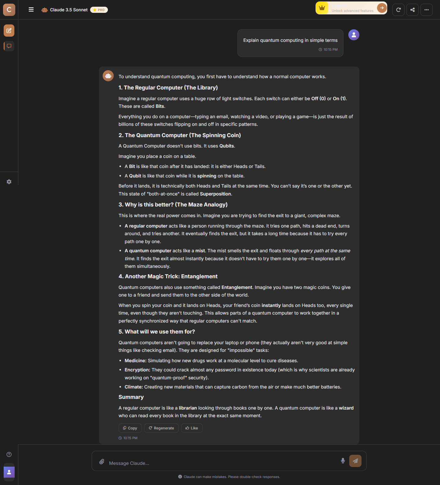

# AI Chatbot

A responsive AI chatbot with an intelligent conversational platform engineered with a modern full-stack architecture, featuring a refined chat experience with conversation management, adaptive theming and responsive interactions — because apparently users expect software to think fast, look good, and never complain 😄

> Note: The UI currently uses Claude-style text and labels, while the backend sends prompts to Gemini through `@google/generative-ai`.

> Built because apparently humans enjoy asking AI things they could Google in 7 seconds 😄

## Glimpse





## Features

- Clean responsive chat UI
- Sidebar with searchable conversation history
- User and assistant message bubbles
- Markdown rendering support
- Syntax highlighted code blocks
- Copy-code functionality
- Typing indicator while AI generates responses
- Suggestion prompt chips
- Rename and delete chat actions
- Dark mode support
- Express backend server
- Gemini AI integration
- Modern frontend architecture
- Express server that serves the frontend from `public/`.
- `/chat` API endpoint connected to Google Gemini.

## Tech Stack

- Frontend: HTML, CSS, vanilla JavaScript
- Backend: Node.js, Express
- AI SDK: `@google/generative-ai`
- Utilities: `dotenv`, `cors`

## Project Structure

```text
AI CHATBOT 3/
│
├── public/
│   ├── index.html
│   ├── script.js
│   └── style.css
│
├── images/
│
├── server.js
├── package.json
├── package-lock.json
├── .env
├── .gitignore
└── README.md
```

## Requirements

Before running the project, make sure you have:

- Node.js installed
- A Gemini API key from Google AI Studio

## Setup

1. Install dependencies:

```bash
npm install
```

2. Create a `.env` file in the project root:

```env
GEMINI_API_KEY=your_gemini_api_key_here
```

3. Start the server:

```bash
node server.js
```

4. Open the app in your browser:

```text
http://localhost:3000
```

## API

### POST `/chat`

Sends a user message to the AI model and returns the generated reply.

Request body:

```json
{
  "message": "Explain JavaScript promises in simple terms"
}
```

Success response:

```json
{
  "reply": "AI generated response..."
}
```

Error response examples:

```json
{
  "reply": "Message is required"
}
```

```json
{
  "reply": "API error occurred",
  "error": "Error message"
}
```

## Configuration

Current model configuration:

The Gemini model is configured in `server.js`:

```js
const model = genAI.getGenerativeModel({
  model: "gemini-3-flash-preview",
});
```

To use another supported model, replace the model name inside `server.js`.

## Development Notes

- Static frontend files are served from the `public/` folder.
- `.env` and `node_modules/` are ignored by Git and excluded from repository uploads.
- The current `npm test` script is a placeholder and does not run automated tests yet.
- The server runs on port `3000`.

## Troubleshooting

### `GEMINI_API_KEY missing in .env file`

Make sure the `.env` file exists in the project root and contains:

```env
GEMINI_API_KEY=your_gemini_api_key_here
```

### Browser cannot open `localhost:3000`

Confirm that the server is running:

```bash
node server.js
```

Then open:

```text
http://localhost:3000
```

### AI response is not coming

- Check that the Gemini API key is valid.
- Check the terminal output for the full backend error.
- Confirm that the `/chat` route is receiving a non-empty `message`.
- And Internet Connectivity.

## Performance Philosophy

Users:

> "Why isn't AI instant?"

Backend:

> "Relax. I'm literally talking to another AI." 😄

---

## License

MIT License

Copyright (c) 2026

Permission is hereby granted, free of charge, to any person obtaining a copy of this software and associated documentation files to deal in the Software without restriction.

---

ISC Licence

This project currently uses the ISC license from `package.json`.

See the LICENSE file for more information.

---

## 💀 Engineering Reality

- 5% Coding
- 20% Debugging
- 75% Wondering why yesterday's code suddenly stopped working 😄

---

##  Built With

- ☕ Caffeine
- 🐛 Debugging
- 🔄 Browser Refresh Button
- 🧠 Stack Overflow Memories

## 👑 Author 

## 🧑‍💻Name - **PERVEZ ALAM**  
📂 GitHub - [https://github.com/PERVEZ-ALAM1234567](https://github.com/PERVEZ-ALAM1234567)  
✉️ E-mail - pervezalam1234567@gmail.com  
🔗 LinkedIn - [http://www.linkedin.com/in/pervez-alam1](http://www.linkedin.com/in/pervez-alam1)

---

Feel free to contribute, suggest new features, or report any issues by creating an issue or a pull request.
